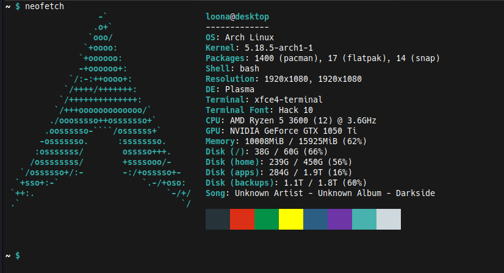
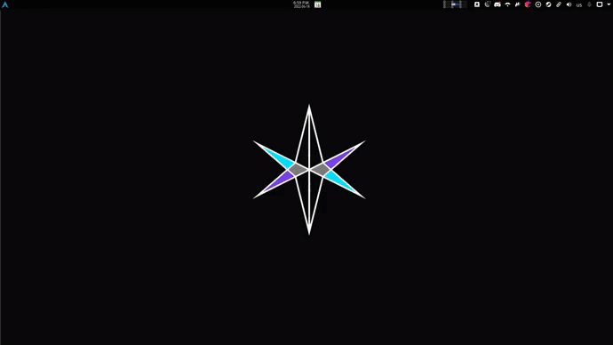

# .dotfiles
Various config, .*rc, scripts and lists of packages in my current setup.


## setup
neofetch:


demo:



## included files/folders:
- .bashrc
- .pythonrc
- .repl.js (node.js rc)
- .vimrc
- .vim/
- pacman_packages
- snap_packages
- flatpak_packages
- .themes/
- .fonts/
- .icons/
- wallpaper
- arch_install_script.sh
- auto start scripts
- calculators
- crontab scripts
- macros
- other helpful scripts

## todo:
- add node and ruby rc's
- fix up the vim stuff
- keep track of all packages. shouldnt be too hard; just a command to list all packages and echo to a file
- move the aesthetics stuff to the aesthetics folder
- re-write the arch script
- make a script that auto-does all this for me. and commits it here too???
- cant add .vim/ directory because the plugins all have .git/ directories. will see if these are necessary


## Macros
- uses Autokey

## scripts
contains a number of scripts i occasionally/often use.
In my current setup, i have set this directory to be part of my $PATH

## autostart
Scripts run on startup.
I use KDE's autostart to run these.


## packages
All packages are listed in text files
### Install
cd into the packages directory first.
atm, flatpak packages cannot be automated. snaps, pacman and apt can be tho 
```sh
cd packages
```

```sh
 for x in $(cat pacman.txt); do pacman -S $x; done
 for y in $(cat apt.txt); do apt install $y; done
 for z in $(cat snap.txt); do snap install $z; done
```

## installing for yourself
I will need to rework the arch install script. for now though, there is some code, although out of date.
